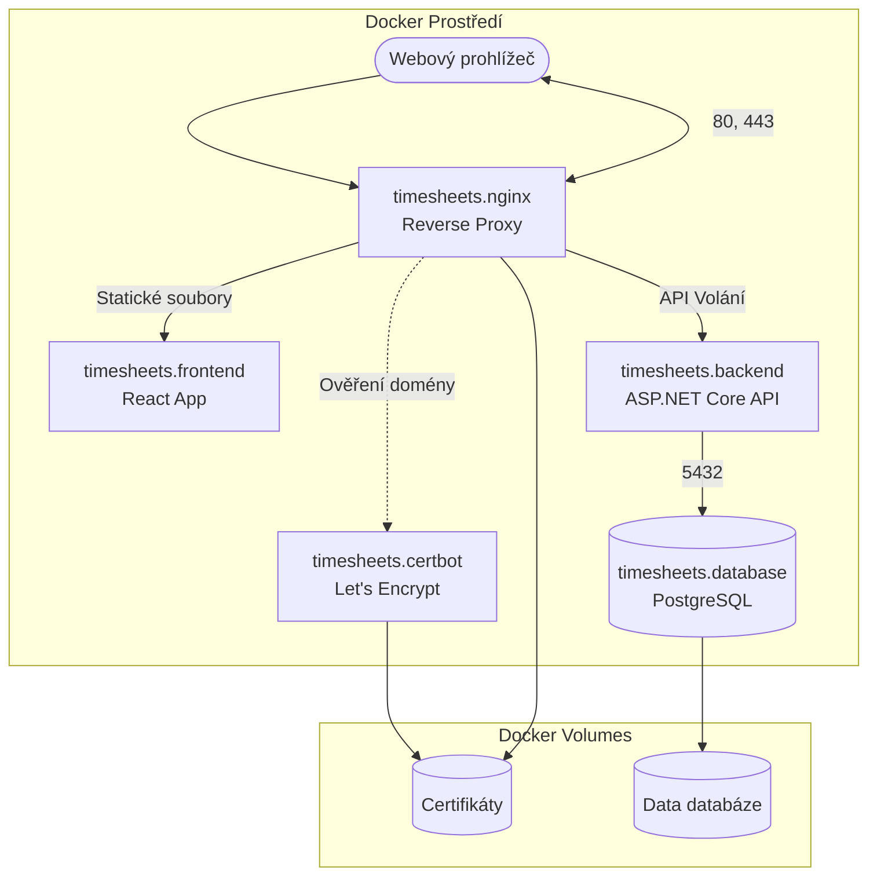
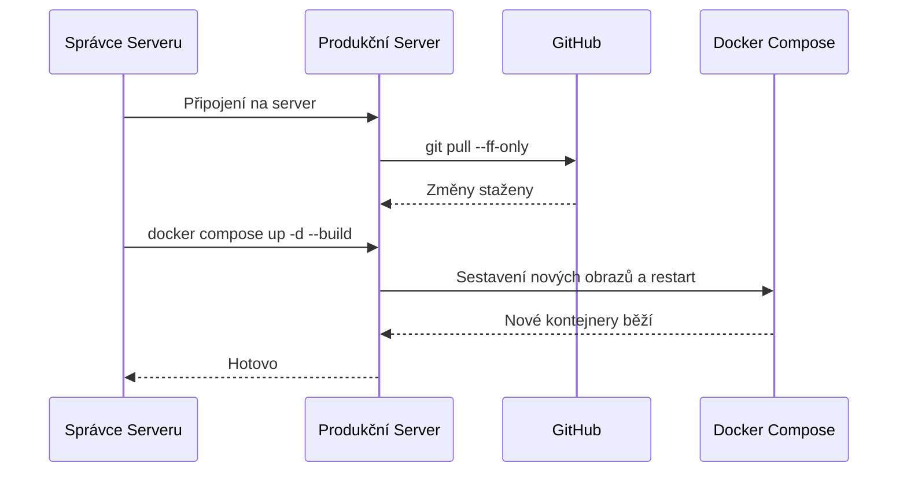

# Návod k nasazení (Deployment Guide)

Tento dokument popisuje proces nasazení webové aplikace Výkazy (Timesheets) z pohledu samotného zdrojového kódu a poskytnuté Docker konfigurace. Návod předpokládá, že na cílovém serveru je již nainstalován Docker a Docker Compose a je zajištěna připravená veřejná doména. Správa samotného serveru (OS, firewall atd.) není předmětem tohoto dokumentu.

## Architektura kontejnerů

Aplikace je rozdělena do několika mikroslužeb, které společně komunikují v uzavřené vnitřní síti Dockeru. Zde je přehled architektury:



### Jednotlivé služby:
- **`timesheets.nginx`**: Hlavní vstupní bod. Slouží jako reverse proxy, zpracovává HTTPS komunikaci a směruje provoz na frontend nebo backend.
- **`timesheets.frontend`**: Kontejner obsahující produkční build React aplikace obsluhovaný přes nginx (interně).
- **`timesheets.backend`**: ASP.NET Core API na interním portu 5000. Při startu automaticky řeší nezbytné databázové migrace.
- **`timesheets.database`**: Databáze PostgreSQL 17. Data jsou bezpečně uložena v perzistentním Docker volume (`timesheets_db`).
- **`timesheets.certbot`**: Služba pro automatické vystavení a obnovu bezplatných SSL certifikátů.

---

## 1. Příprava repozitáře

Nejprve stáhněte zdrojové kódy na cílový server:

```bash
git clone https://github.com/ondrejsvorc/Timesheets.git
cd Timesheets
```

Pokud aplikace nemá běžet z hlavní větve (`main`), přepněte na požadovanou větev:
```bash
git checkout <nazev-vetve>
```

## 2. Konfigurace prostředí (.env)

Klíčovým krokem je vytvoření souboru `.env`, který obsahuje produkční proměnné prostředí. Tento soubor se kvůli bezpečnosti (hesla a tajné klíče) nikdy necommituje do gitu.

Vytvořte soubor ze šablony:
```bash
cp .env.example .env
nano .env
```

**Doplňte tyto zásadní proměnné:**
- `POSTGRES_PASSWORD`: Silné heslo k databázi (uživatel postgres). *Následně ho po prvním spuštění neměňte, pokud neprovádíte řízenou migraci.*
- `PUBLIC_HOST`: Vaše produkční doména (např. `vykazy.mojedomena.cz`) **bez** `https://`.
- `LETSENCRYPT_EMAIL`: Váš e-mail pro notifikace ohledně SSL certifikátů.
- `AUTHENTICATION__CLIENTID`: Klientské ID získávané od OpenID Connect poskytovatele identity.
- `AUTHENTICATION__CLIENTSECRET`: Tajný klíč (secret) od poskytovatele identity.
- `ADMINISTRATION__ROLEMANAGERPERSONALNUMBERS__0`: Osobní číslo prvního uživatele, který dostane oprávnění spravovat systémové role (lze přidat další pomocí `...__1`, `...__2`).

Pro maximální bezpečnost zamezte čtení tohoto souboru ostatním uživatelům na serveru:
```bash
chmod 600 .env
```

## 3. Sestavení a spuštění (První nasazení)

Produkční konfigurace je definována v souboru `docker-compose.prod.yml`.

Nejprve můžete zkontrolovat, zda v souboru `.env` nechybí nějaká povinná hodnota a konfigurace je validní:
```bash
docker compose -f docker-compose.prod.yml config
```

Sestavte Docker images z lokálního kódu a spusťte všechny kontejnery na pozadí:
```bash
docker compose -f docker-compose.prod.yml up -d --build
```

**Užitečné příkazy pro kontrolu stavu:**
- Výpis běžících kontejnerů: `docker compose -f docker-compose.prod.yml ps`
- Sledování logů aplikace (pro ukončení stiskněte Ctrl+C): `docker compose -f docker-compose.prod.yml logs -f`

Aplikace je nyní nasazena. Můžete ji ověřit zadáním vaší domény do prohlížeče.

## 4. Aktualizace (Nasazení nové verze)

Při vydání aktualizace (např. po mergi nové funkce) je proces nasazení přímočarý.



**Postup v příkazech:**

1. Přejděte do složky s projektem:
   ```bash
   cd Timesheets
   ```
2. Stáhněte nejnovější úpravy z repozitáře:
   ```bash
   git pull --ff-only
   ```
3. *[Doporučeno] Vytvořte rychlou zálohu databáze:*
   ```bash
   mkdir -p backups
   docker compose -f docker-compose.prod.yml exec -T timesheets.database pg_dump -U postgres -d timesheets -Fc > "backups/db_$(date +%Y%m%d).dump"
   ```
4. Sestavte a spusťte novou verzi (staré kontejnery budou automaticky nahrazeny bez výpadku zachovaných dat):
   ```bash
   docker compose -f docker-compose.prod.yml up -d --build
   ```

Backend kontejner si při startu opět automaticky zkontroluje a případně aplikuje nové databázové změny (migrace). Z vaší strany nejsou potřeba žádné další kroky.
