# Uživatelská příručka

## O aplikaci

Webová aplikace Výkazy slouží ke správě pracovních výkazů a souvisejících údajů o univerzitních projektech, zakázkách a pracovních pozicích.

## Uživatelské role a oprávnění

Aplikace zobrazuje své jednotlivé části podle role přihlášeného uživatele. Každý uživatel má přístup ke svým vlastním pracovním výkazům. Další oprávnění získává podle toho, zda dále působí jako manažer zakázky, manažer projektu nebo globální manažer.
| Role | Popis |
|---|---|
| Zaměstnanec | Může si zobrazit své výkazy, nahrát docházku z IMIS, upravit svůj výkaz, odeslat jej ke schválení a po schválení projektových částí provést finální schválení vlastního výkazu. |
| Manažer zakázky | Může pracovat se zakázkami, ke kterým je přiřazen. Vidí výkazy zaměstnanců přiřazených k dané zakázce a schvaluje zakázkové části výkazu. |
| Manažer projektu | Může spravovat projekty, ke kterým je přiřazen. Může spravovat zakázky v rámci projektu a přiřazovat manažery zakázek. |
| Globální manažer | Má přístup ke všem projektům, zakázkám, zaměstnancům a výkazům. Může vytvářet projekty a provádět finální schválení výkazů. |
| Správce systému | Spravuje technická nebo systémová oprávnění uživatelů. Tato role není určena pro běžnou práci s výkazy. |

### Typ zaměstnance Akademik / Neakademik

Kromě uživatelských rolí aplikace rozlišuje také typ zaměstnance: **Akademik** a **Neakademik**. Tento údaj neurčuje, jaké části aplikace může uživatel spravovat, ale ovlivňuje způsob práce s výkazem.

Typ zaměstnance se do aplikace přenáší automaticky při přihlášení podle údajů ze systému IMIS. Uživatel jej nemůže ručně změnit. Pokud se typ zaměstnance v IMIS změní, aplikace změnu zohlední při dalším přihlášení uživatele. Již vytvořené výkazy se tím ale zpětně nezmění. Každý výkaz si při svém vytvoření uloží aktuální typ zaměstnance jako historický údaj. Díky tomu zůstane výkaz vyhodnocen podle pravidel platných v době jeho vytvoření a pozdější změna typu zaměstnance nijak neovlivní jeho obsah.

Rozdíl mezi typy zaměstnance je důležitý hlavně při práci s docházkou a výkazem. U neakademických pracovníků se pracuje s docházkou podle nahraných časů a pravidel pro pracovní dobu. U akademických pracovníků se výkaz vyhodnocuje odlišně, protože jejich pracovní režim není být založen na běžné evidenci příchodů a odchodů.

## Jak aplikace pracuje s docházkou z IMIS

Aplikace zatím není přímo napojena na IMIS. Docházku je proto nutné nejprve exportovat z IMIS do souboru `.xls` nebo `.xlsx` a tento soubor následně nahrát do aplikace. Po nahrání aplikace ze souboru přečte potřebná data a uloží si je. Další úpravy už probíhají přímo v aplikaci. Pokud je docházka z IMIS exportována znovu, lze ji znovu nahrát pouze u výkazu ve stavu *Rozpracovaný*.

### Doporučený postup práce s výkazem
1. Zaměstnanec exportuje docházku z IMIS za daný měsíc.
1. Zaměstnanec nahraje docházku z IMIS za daný měsíc do aplikace.
1. Zaměstnanec zkontroluje docházku a doplní rozdělení hodin mezi kmenovou a projektovou část.
1. Pokud pracovní výkaz neobsahuje chyby, zaměstnanec jej odešle ke schválení.
1. Manažeři zakázek nebo projektů schválí projektové části výkazu.
1. Po schválení všech projektových částí zaměstnanec svůj pracovní výkaz finálně schválí.

## Přístup do aplikace

### Přihlášení

Pro přihlášení do aplikace zadejte své přihlašovací údaje do systému IMIS (uživatelské jméno a heslo).

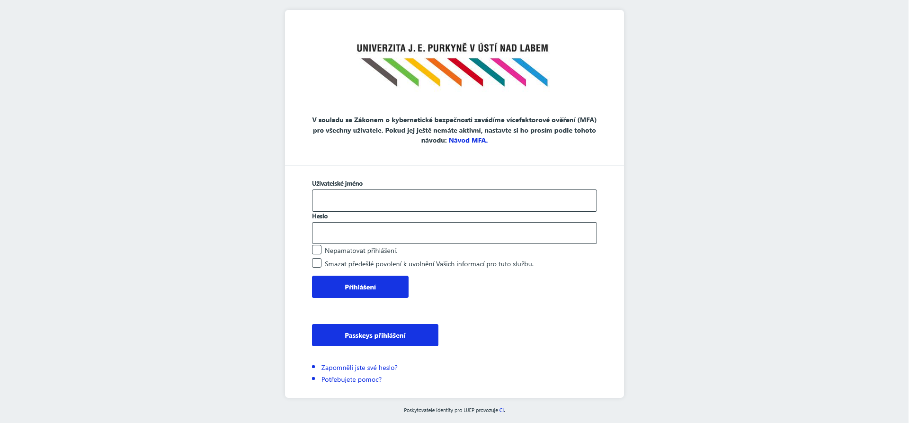

### Odhlášení

Pro odhlášení klikněte na ikonu profilu a v zobrazené nabídce zvolte možnost *Odhlásit se*.

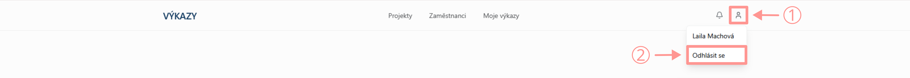

## Projekty

Modul Projekty slouží ke správě univerzitních projektů. Projekt představuje nejvyšší organizační celek, pod který jsou následně zařazeny jednotlivé zakázky. U každého projektu lze evidovat základní identifikační údaje, dobu jeho platnosti a odpovědné osoby.

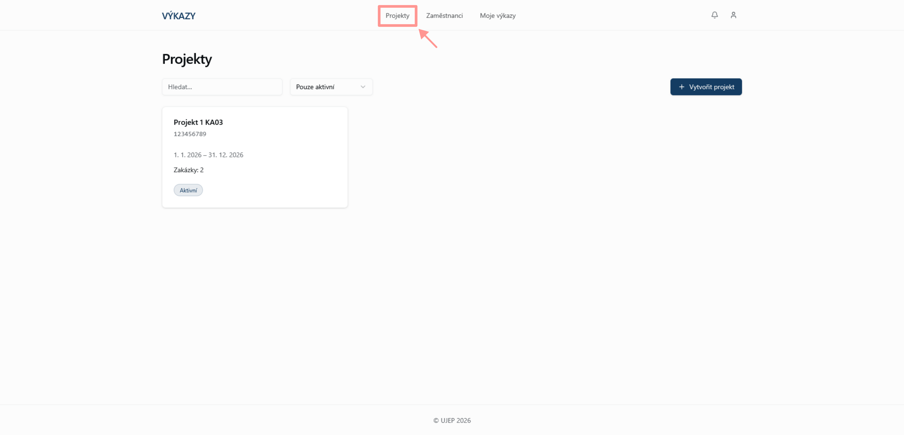

### Vytvoření projektu

Vytvoření projektu může provést uživatel s rolí *Globálního manažera* kliknutím na tlačítko *Vytvořit projekt* na stránce projektů.

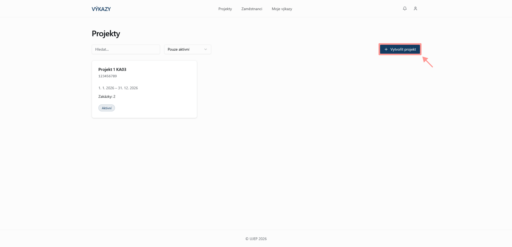

### Úprava projektu

Upravit údaje projektu může provést uživatel s rolí *Globálního manažera* nebo *Manažera projektu* kliknutím na *Upravit* v nabídce akcí u daného projektu.

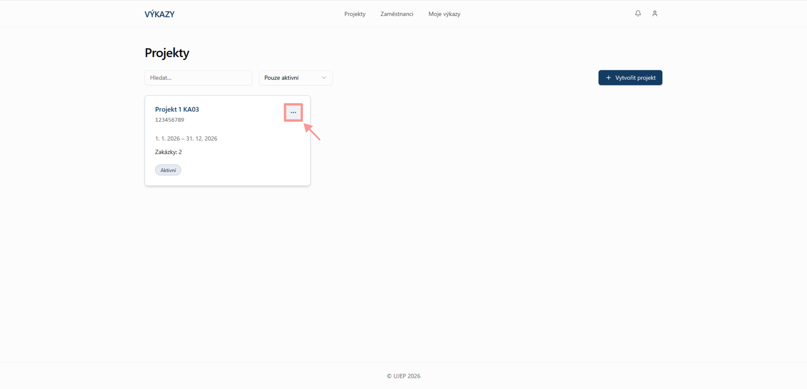
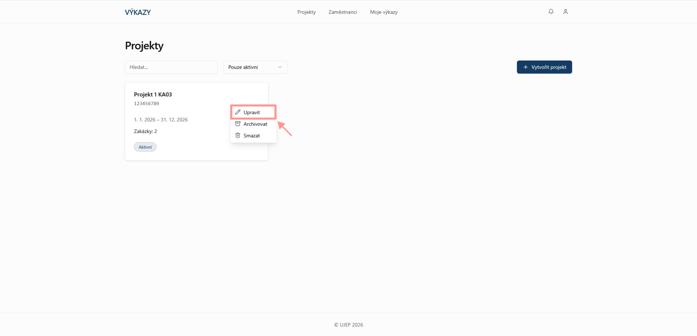
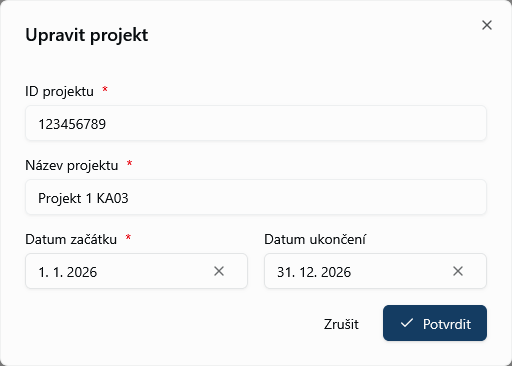

### Přidání manažera projektu

Přidat manažera k projektu může provést uživatel s rolí *Globálního manažera* kliknutím na *Přidat manažera* na stránce detailu projektu, v záložce *Manažeři projektu*.

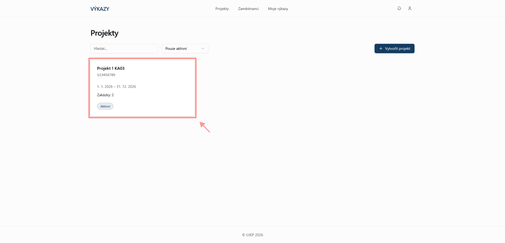

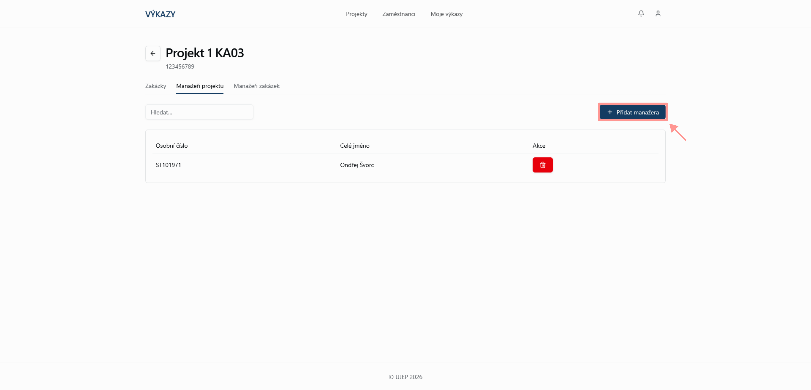

### Archivace projektu

Archivovat projekt může uživatel s rolí *Globálního manažera* nebo *Manažera projektu* kliknutím na *Archovovat* v nabídce akcí daného projektu.

### Obnovení projektu z archivu

Obnovit projekt může uživatel s rolí *Globálního manažera* nebo *Manažera projektu* kliknutím na *Obnovit z archivu* v nabídce akcí daného projektu.

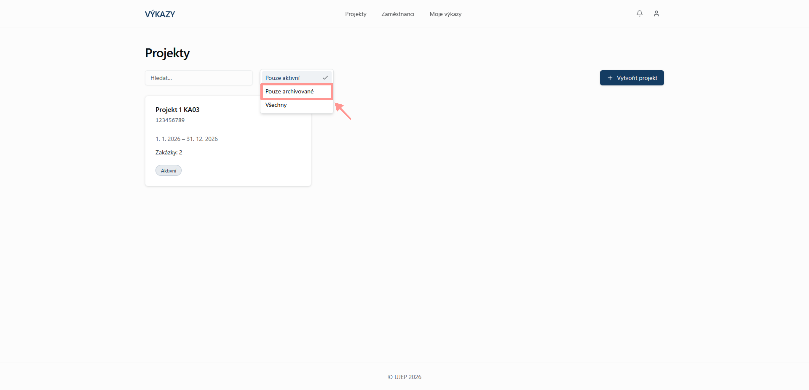
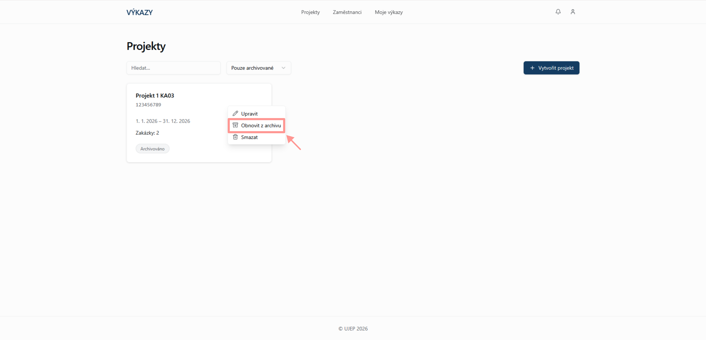

### Smazání projektu

Smazat projekt může uživatel s rolí *Globálního manažera* nebo *Manažera projektu* kliknutím na *Smazat* v nabídce akcí daného projektu.

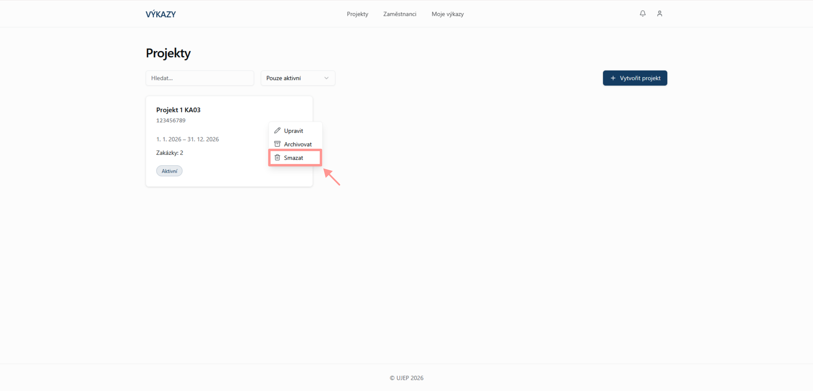

## Zakázky

Modul Zakázky představují dílčí části projektů, ke kterým jsou přiřazováni zaměstnanci a ve kterých následně vykazují odpracovaný čas. Každá zakázka je vždy součástí konkrétního projektu a může mít vlastního manažera odpovědného za schvalování vykázané práce.

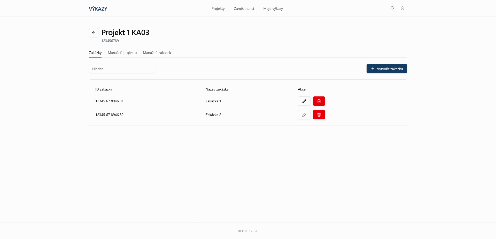

### Vytvoření zakázky

Vytvořit zakázku může uživatel s rolí *Globálního manažera* nebo *Manažera projektu* kliknutím na *Vytvořit zakázku* na stránce detailu projektu, v záložce *Zakázky*.

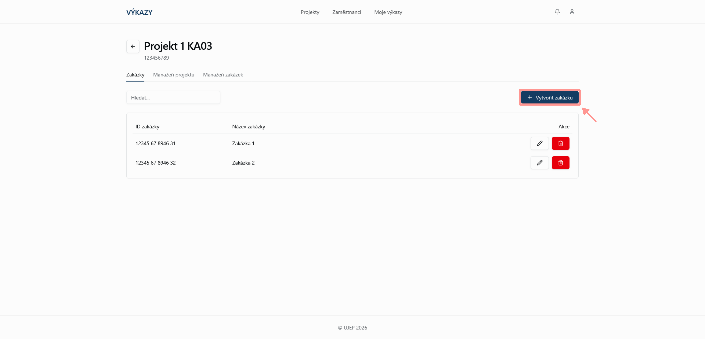

### Úprava zakázky

Úpravu údajů zakázky může provést uživatel s rolí *Globálního manažera* nebo *Manažera projektu* kliknutím na ikonu upravit pro danou zakázku na stránce detailu projektu, v záložce *Zakázky*.

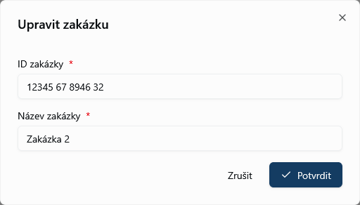

### Přidání manažera zakázky

Přidat manažera k zakázce může uživatel s rolí *Globálního manažera* nebo *Manažera projektu* kliknutím na *Přidat manažera* na stránce detailu projektu, v záložce *Manažeři zakázek*.

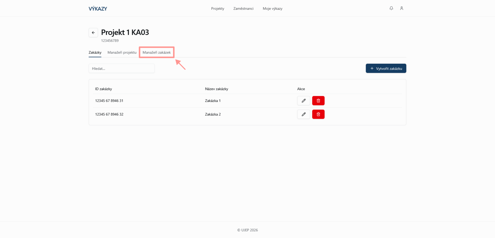

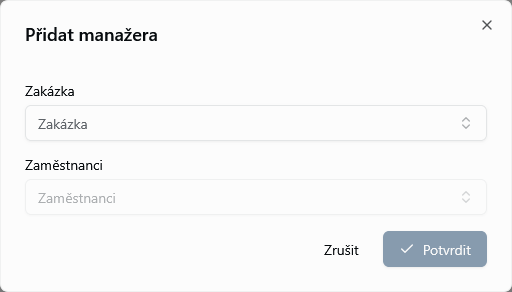

### Zobrazení detailu zakázky

Zobrazení detailu zakázky může uživatel s rolí *Globálního manažera* nebo *Manažera projektu* nebo *Manažera zakázky* rozkliknutím daného záznamu zakázky v tabulce na stránce detailu projektu, v záložce *zakázky*.

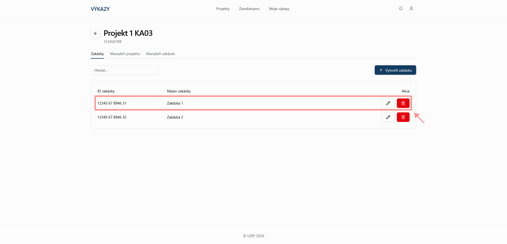
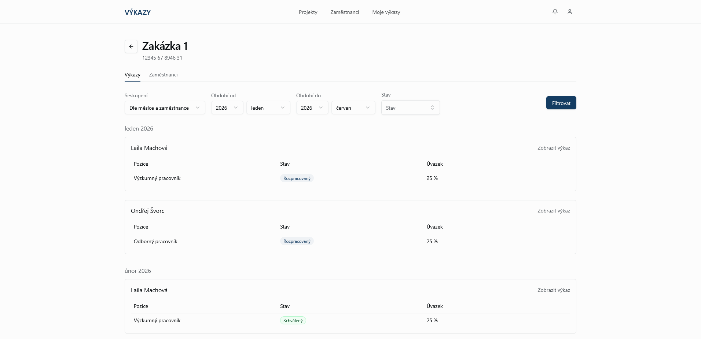

#### Přehled výkazů v zakázce - změna seskupení

Přehled výkazů na stránce detailu zakázky lze seskupovat dvojím způsobem. Změna seskupení se provádí volbou v sekci filtování výsledku v přehledu.

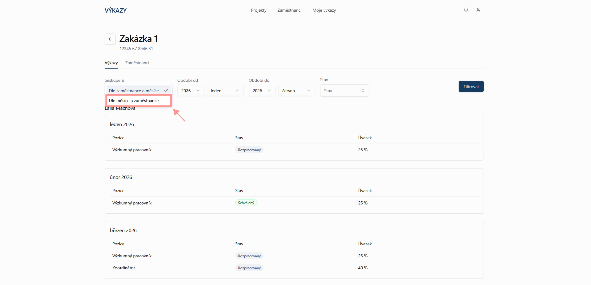
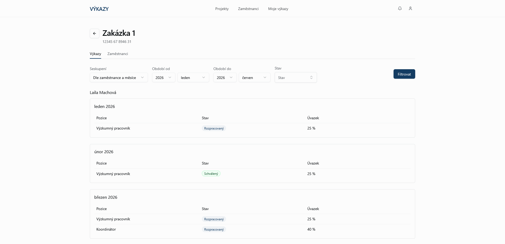

### Přidání zaměstnance do zakázky (vytvoření pracovní pozice zaměstnance)

Přidat zamstnance do zakázky, tzn. vytvořit mu v zakázce pracovní pozici, může uživatel s rolí *Globálního manažera* nebo *Manažera projektu* nebo *Manažera zakázky* kliknutím na *Přidat zaměstnanci pozici* na stránce detailu zakázky, v záložce *Zaměstnanci*.

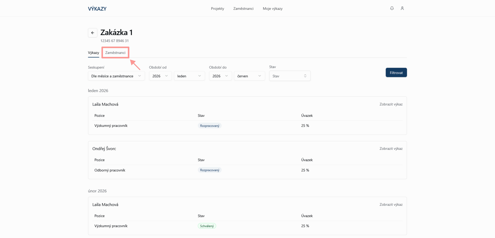
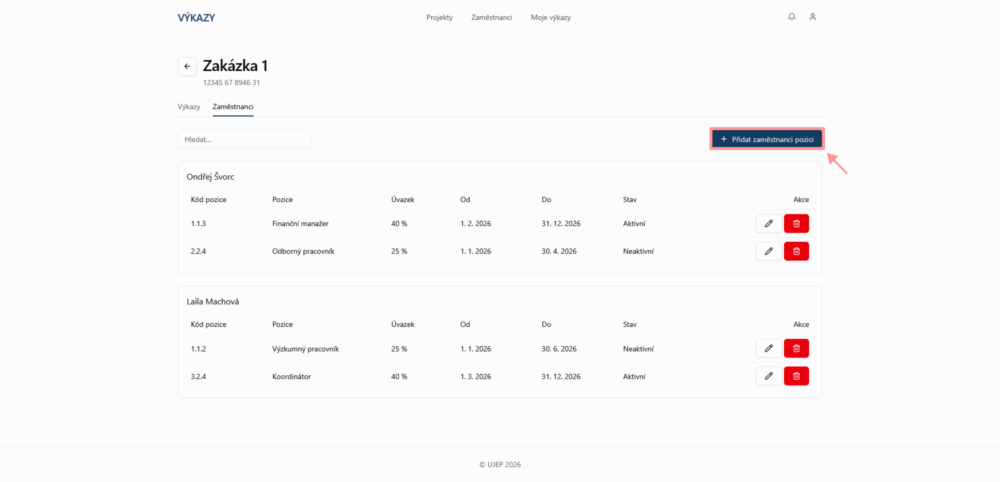
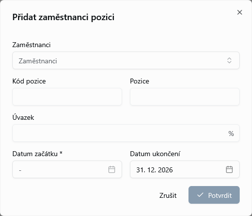

### Úprava pozice zaměstnance v zakázce

Upravit zaměstnanci pracovní pozici v zakázce může uživatel s rolí *Globálního manažera* nebo *Manažera projektu* nebo *Manažera zakázky* kliknutím na ikonu upravit u dané pozice na stránce detailu zakázky, v záložce *Zaměstnanci*.

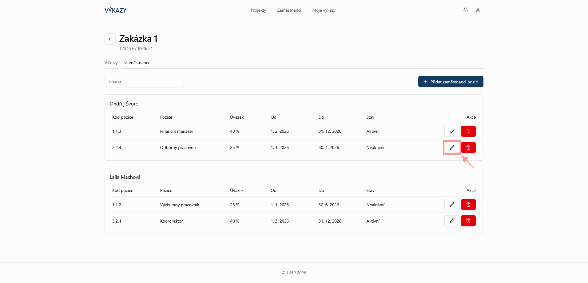
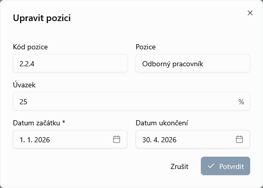

### Smazání pozice zaměstnance v zakázce

Upravit zaměstnanci pracovní pozici v zakázce může uživatel s rolí *Globálního manažera* nebo *Manažera projektu* nebo *Manažera zakázky* kliknutím na ikonu smazat u dané pozice na stránce detailu zakázky, v záložce *Zaměstnanci*.

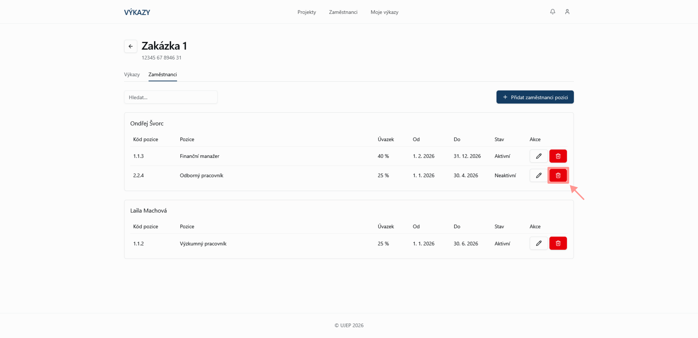

## Zaměstnanci

Modul Zaměstnanci slouží ke správě pracovních pozic zaměstnanců v jednotlivých zakázkách. U každé pozice lze evidovat období platnosti, rozsah úvazku a další údaje potřebné pro správné vytváření a vyhodnocování pracovních výkazů.

### Přehled pracovních pozic

Každý zaměstnanec může zorbrazit přehled svých pracovních pozic. Zobrazení pozic ostatních zaměstnanců mohou uživatelé s vyšším oprávněním než je role *Zaměstnanec* rozkliknutím záznamu v tabulce pro daného zaměstnance.

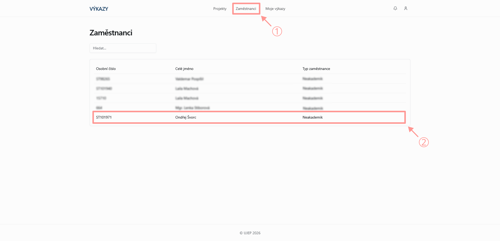
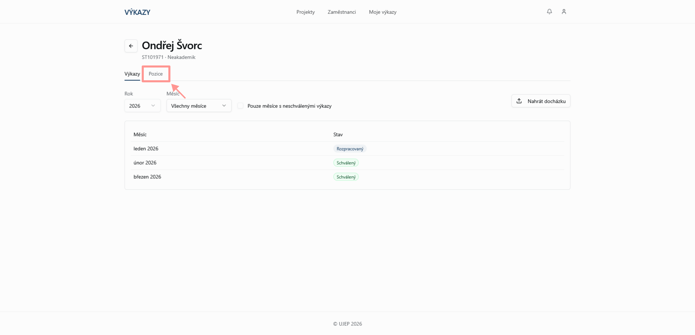

### Vytvoření pracovní pozice

Vytvořit pracovní pozici zaměstnanci mohou uživatelé s vyšším oprávněním než je role *Zaměstnanec*.

Vytvořit pozici lze dvěma způsoby:
1) Přes zaměstnance
Otevření přehledu pracovních pozic daného zaměstnance viz *Zaměstnanci > Přehled pracovních pozic*
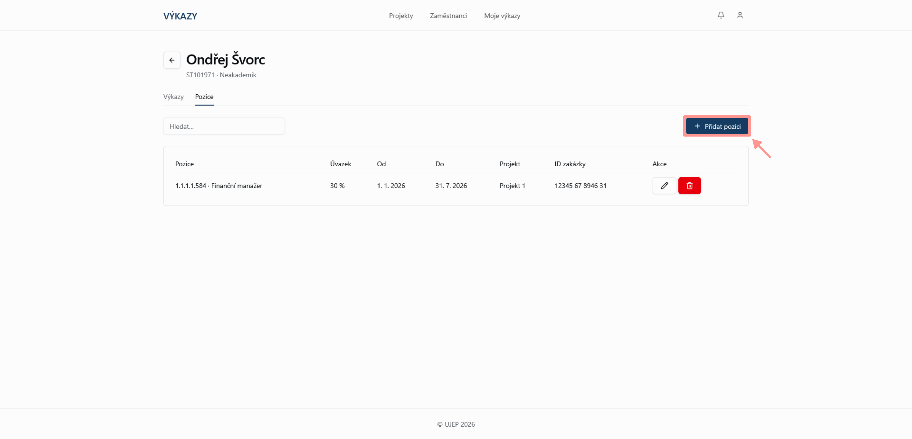
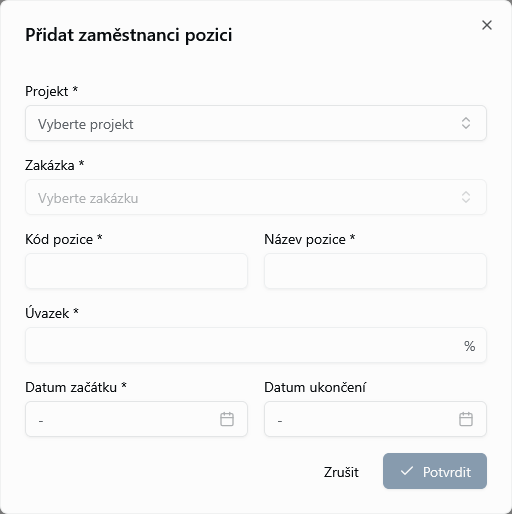

2) Přes zakázku – viz *Zakázky > Přidání zaměstnance do zakázky (vytvoření pracovní pozice zaměstnance)*

### Úprava pracovní pozice

Upravit pracovní pozici zaměstnanci mohou uživatelé s vyšším oprávněním než je role *Zaměstnanec*.

Vytvořit pozici lze dvěma způsoby:
1) Přes zaměstnance
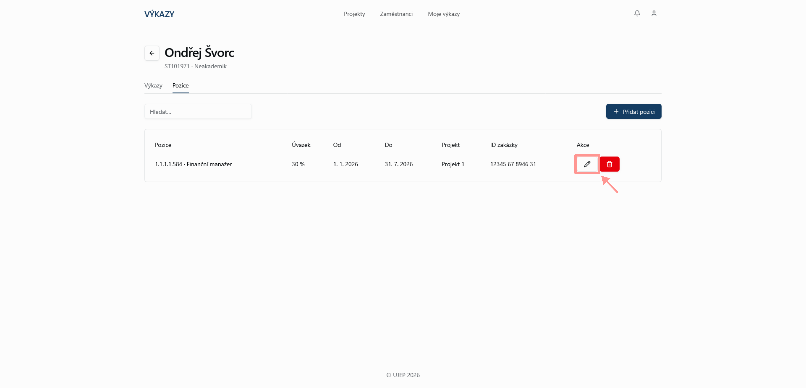

2) Přes zakázku – viz *Zakázky > Úprava pozice zaměstnance v zakázce*

## Docházka

Modul Docházka slouží k nahrání docházkových dat exportovaných ze systému IMIS. Nahraná data představují podklad pro vytváření pracovních výkazů a kontrolu vykázané pracovní doby.

### Export docházky z IMIS

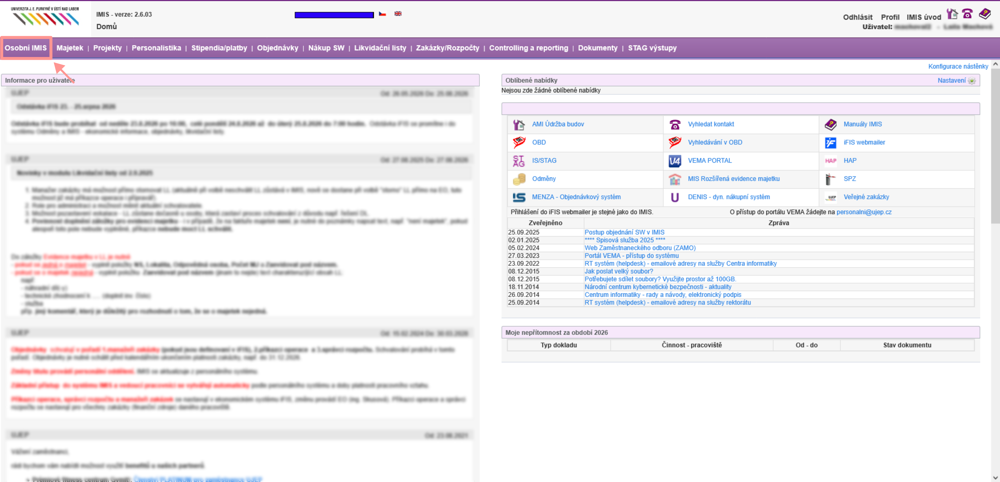
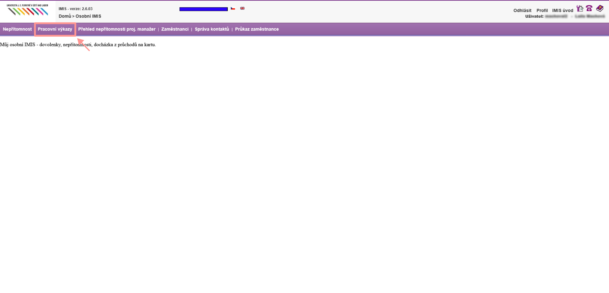
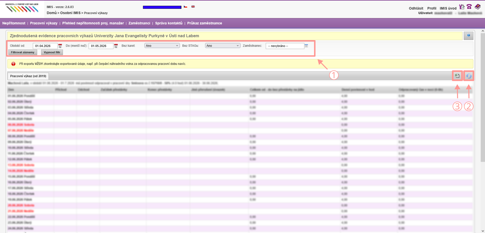

Příklad exportu docházky za měsíc duben 2026. Pokud není datum vylněn, exportuje se automaticky aktuální měsíc. Datum pro export měsíční docházky je potřeba zadat vždy od 1. daného měsíce do 1. následujícího měsíce, nikoliv od 1. do 31. téhož měsíce.

### Nahrání docházky z IMIS

V současné době není aplikace propojena se systémem IMIS. Docházku je proto nutné nejprve exportovat ze systému IMIS a následně ji nahrát do aplikace Výkazy.

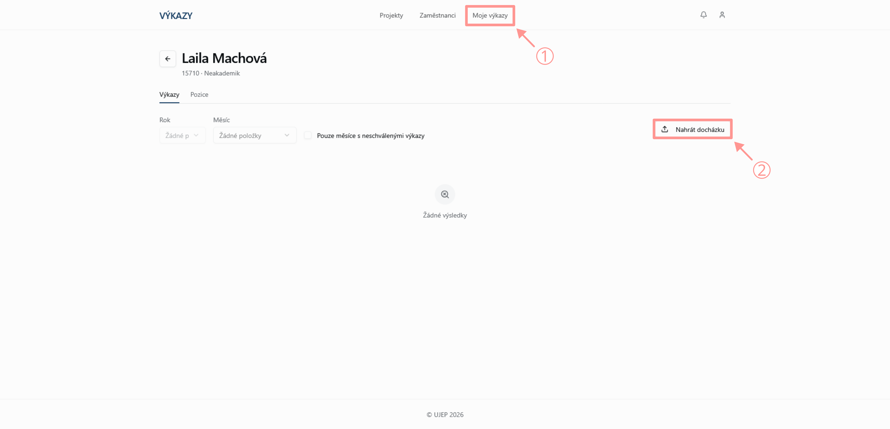
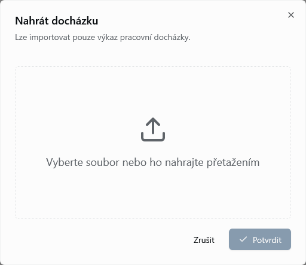

## Výkazy

Modul Výkazy slouží k evidenci, úpravám a schvalování pracovních výkazů zaměstnanců. Uživatel zde může sledovat stav jednotlivých výkazů, doplňovat vykázanou práci a pracovat s připomínkami vzniklými během schvalovacího procesu.

### Zobrazení výkazu

1) Přes zaměstnance

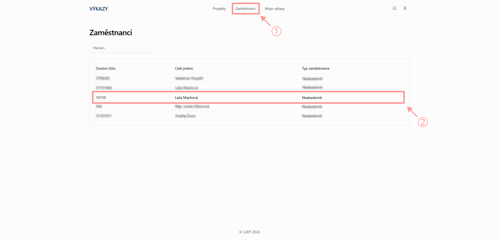
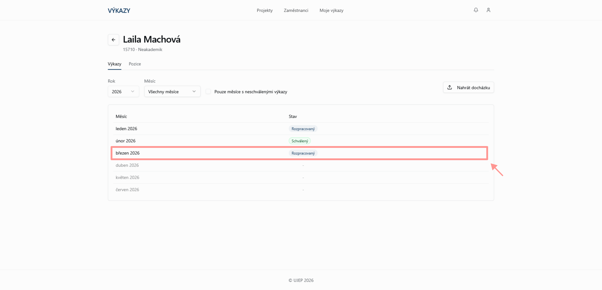
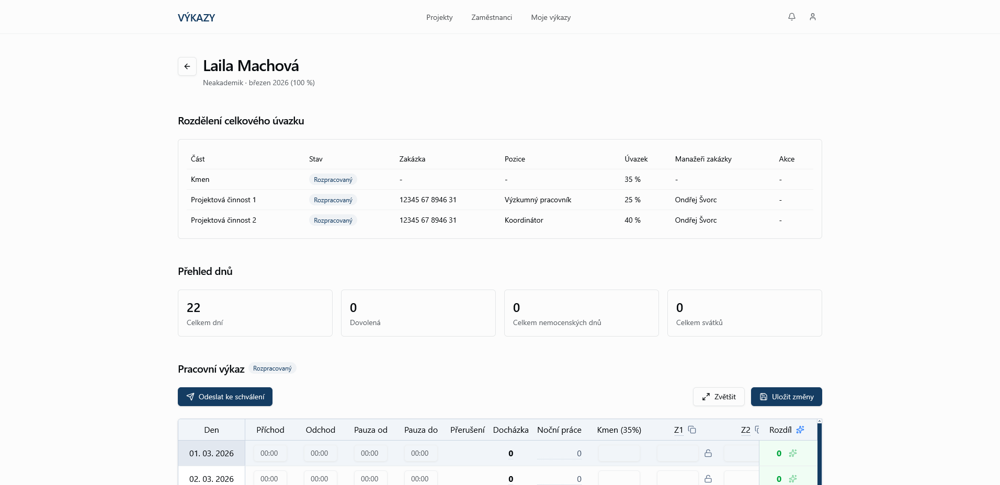

2) Přes zakázku – tento krok vychází ze zobrazení detailu zakázky (viz *Zakázky > Zobrazení detailu zakázky*)

    2.1 Seskupení dle měsíce a zaměstnance
    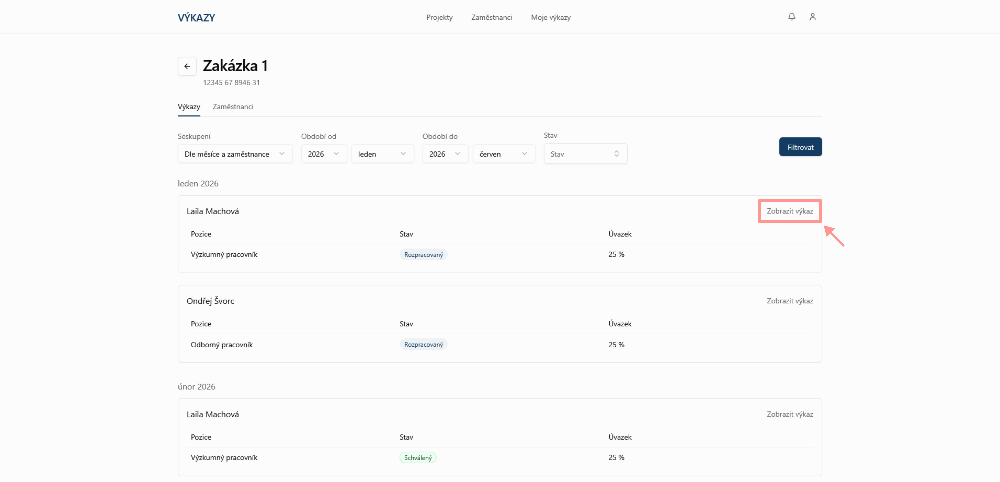

    2.2 Seskupení dle zaměstnance a měsíce
    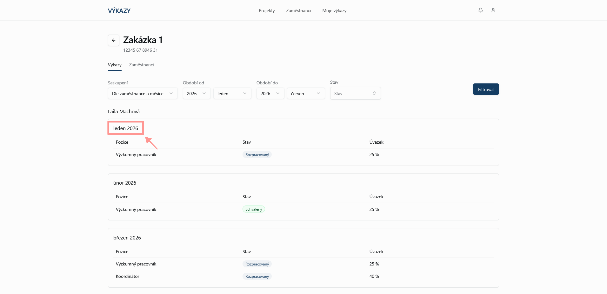

### Zvětšení tabulky s kombinovaným výkazem

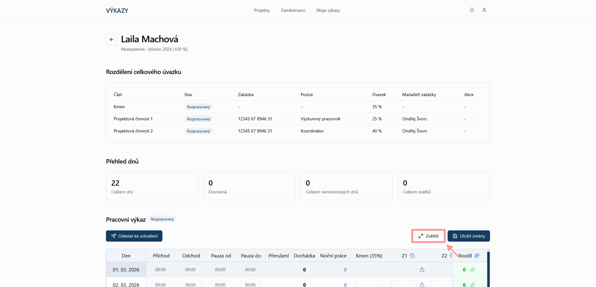

### Úprava výkazu

Níže na obrázku jsou popsány základní prvky a operace kombinovaného výkazu:

1) Sloupec pro projektovou činnost – po najetí myší na název sloupce se zobrazí detailní informace (projekt, zakázka, úvazek)

2) Zamykání buněk tabulky – ikona zámečku slouží pro uzamčení hodnoty buňky v tabulce. Takto zamčené buňky si při generování hodnot uchovají zadanou fixní hodnotu.

3) Zkopírování odpracovaných hodin v projektu – kliknutím na ikonu kopírovat se zkopírují hodnoty celého sloupce (pro předenesní hodnot například do dokumentu pro výkaz projektové činnosti).

4) Generování hodnot pro celý výkaz - kliknutím na ikonu generovat se vygenerují hodnoty pro celou tabulku výkazu.

5) Generování hodnot pro jednotlivý řádek - kliknutím na ikonu generovat se vygenerují hodnoty pro daný řádek.

6) Kontrolní součtový řádek – ve formátu *celkem vyplněných hodin / celkem hodin potřebných vyplnit*. Sloupce projektových činností je potřeba splnit přesně, u sloupce pro kmenový úvazek je povolen mírný přesah odpracovaných hodin (max 2 hod).

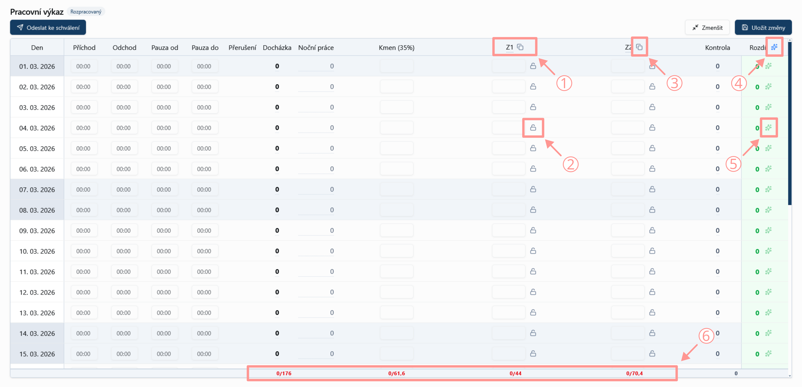

#### Chybové hlášky

Chybové hlášky jsou dvojí závažnosti:
- červené – výstražné,
- žluté – upozorňující.

S červenými hláškami nelze výkaz odeslat ke schváleni, s žlutými je odeslání již možné. Chybové hlášky mohou být pro konkrétní buňky nebo pro celé řádky výkazu.

### Uložení změn v kombinovaném výkazu

Po provedení úprav je vždy zapotřebí uloži změny kliknutím na tlačítko *Uložit změny*.

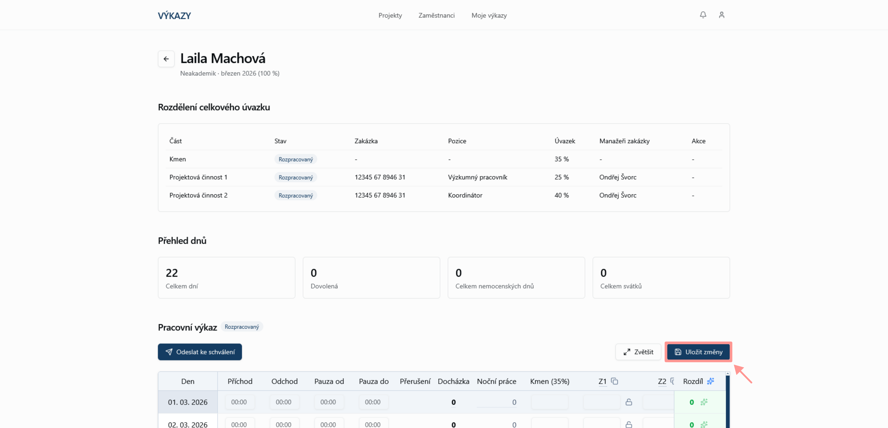

### Schválování výkazu

#### Odeslání kombinovaného výkazu ke schválení

Pokud je vyplněný kombinovaný výkaz bez červených chybových hlášek, lze jej odeslat ke schválení kliknutím na tlačítko *Odeslat ke schválení*. Po odeslání jsou všechny části kombinovaného výkazu ve stavu *Ke schválení*. Provádí zaměstnanec, jehož se pracovní výkaz týka.

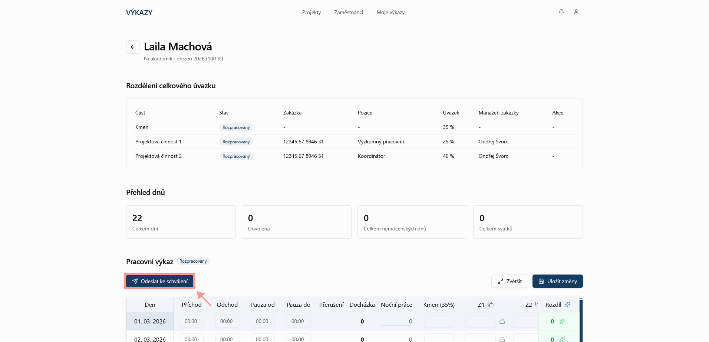

#### Vrácení kombinovaného výkazu k přepracování

*Globální manažer*, *Manažer projektu* či *Manažer zakázky* může vrátit celý kombinovaný výkaz k přepracování kliknutím na tlačítko *Vrátit k přepracování*. Po této akci jsou všechny části kombinovaného výkazu ve stavu *Rozpracovaný*. 

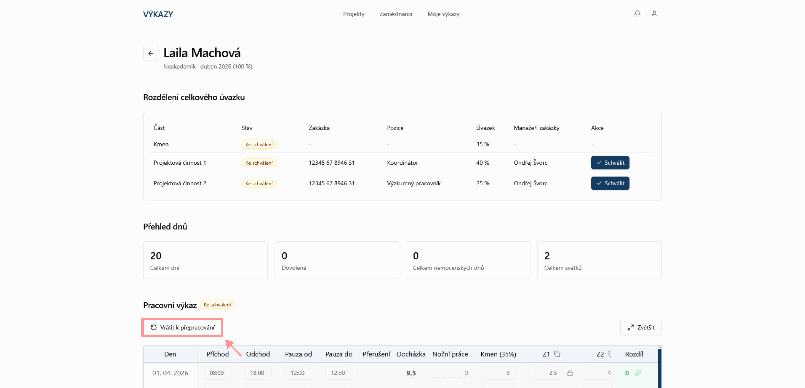
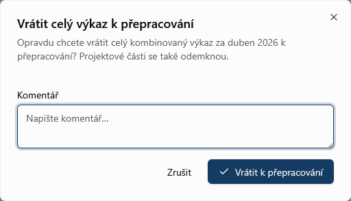

#### Schválení projektové činnosti

Pokud je stav projektové činnosti ve stavu *Ke schválení* může *Manažer projektu* či *Manažer zakázky* schválit projektovou část kombinovaného výkazu kliknutím na tlačítko *Schválit* u dané projektové činnosti. Po této akce je projektová část ve stavu *Schváleno*.

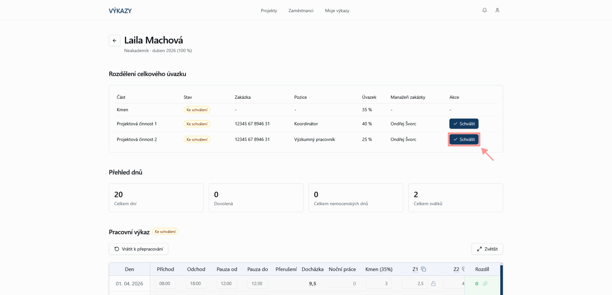
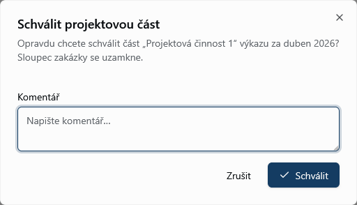

#### Vrácení projektové činnosti k přepracování

*Manažer projektu* či *Manažer zakázky* může vrátit projektovou část kombinovaného výkazu kliknutím na tlačítko *Vrátit* u dané projektové činnosti.

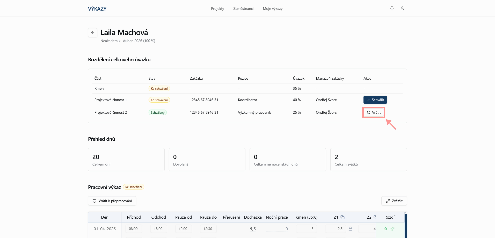
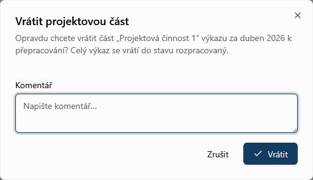

#### Schválení kombimovaného výkazu

Pokud jsou všechny části kombinovaného výkazu ve stavu *Ke schválení* může poté zaměstnanec (jehož se pracovní výkaz týká) nebo *Globální manažer* provést schválení celého výkazu kliknutím na tlačítko *Schválit*. Po této akci jsou všechy části kombinovaného výkazu ve stavu *Schváleno* a výkaz je uzamčený úpravám.

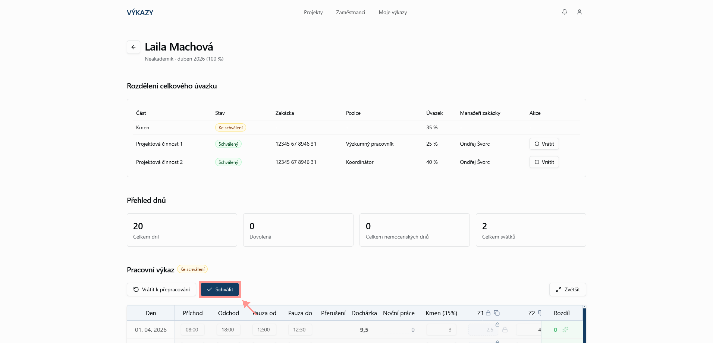
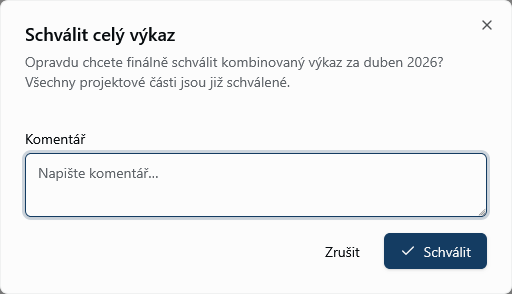

#### Odemknutí kombinovaného výkazu

Odemknout zpět schválený výkaz může zaměstnanec nebo *Globální manažer* kliknutím na talčítko *Odemknout*. Po této akci jsou všechny části kombinovaného výkazu ve stavu *Rozpracováno* a je možná jejich editace.

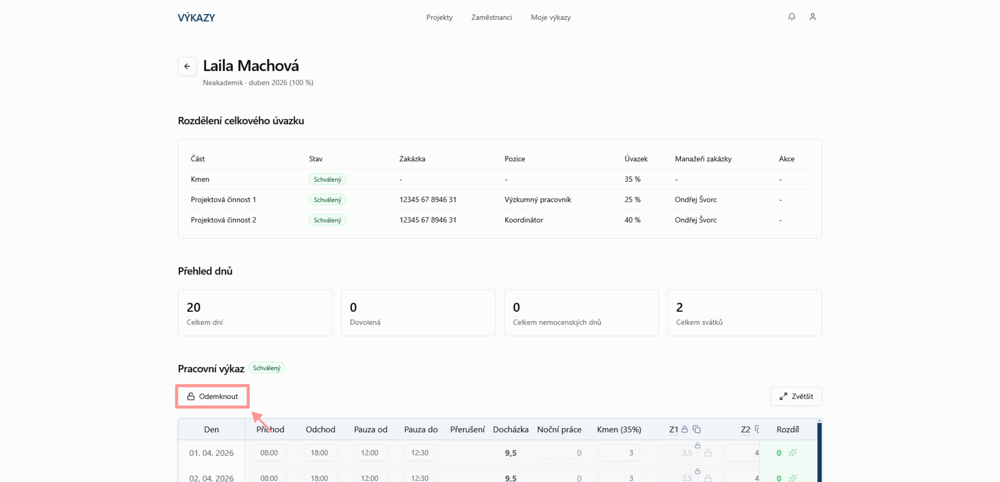
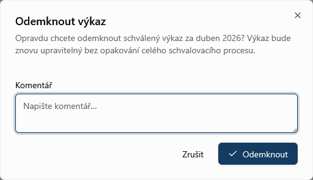

### Historie schvalování a komentářová sekce

## Otázky a odpovědi

**Co se stane, když není vyplněno datum ukončení projektu?**

Projekt zůstává aktivní až do okamžiku, kdy je datum ukončení doplněno. Datum ukončení lze doplnit později.

Příklad: projekt začíná `1. 1. 2026` a datum ukončení není vyplněno. K projektu lze dál vytvářet zakázky a pracovní pozice i po roce 2026, dokud není projekt ukončen.

**Lze datum ukončení projektu změnit?**

Ano. Datum ukončení projektu lze upravit, ale nelze jej zkrátit tak, aby existující pracovní pozice na jeho zakázkách začaly být mimo nové období projektu.

Příklad: projekt končí `31. 12. 2026` a zaměstnanec má na jeho zakázce pozici do `30. 9. 2026`. Projekt nelze zkrátit na `30. 6. 2026`, ale lze jej zkrátit na `30. 9. 2026` nebo později.

**Může být zaměstnanec přiřazen do více zakázek současně?**

Ano. Zaměstnanec může být přiřazen do více zakázek, pokud se tím nepřekročí jeho celkový úvazek pro dané období.

Příklad: zaměstnanec má celkový úvazek `1,0`. Může mít současně `0,4` na jedné zakázce a `0,3` na druhé. Další přiřazení `0,4` už aplikace nepovolí, protože součet by byl `1,1`.

**Lze zaměstnance ze zakázky odebrat?**

Ano, ale pouze pokud daná pozice nemá navázané výkazy ve stavu *Ke schválení* nebo *Schválený*. Pokud takové výkazy existují, odebrání není povoleno.

Příklad: zaměstnanec má na zakázce pozici za březen 2026 a březnový výkaz je již schválený. Pozici nelze odebrat, protože by se tím narušil již schválený výkaz.

**Lze nahrát docházku naráz za více měsíců?**

Nahrát docházku za více měsíců lze pouze formou "jeden měsíc = jeden soubor". Dialog pro nahrání docházky umožňuje přiložit více souborů.

**Kdo může výkaz schválit?**

Projektové části výkazu schvaluje manažer příslušné zakázky nebo projektu. Finální schválení celého výkazu je možné až po schválení všech projektových (resp. zakázkových) částí a provádí jej buď sám zaměstnanec, nebo globální manažer.

Příklad: výkaz obsahuje práci na dvou zakázkách. Každou projektovou část musí nejprve schválit odpovědný manažer. Teprve potom lze schválit celý výkaz.

**Lze upravovat již schválený výkaz?**

Ne přímo. Schválený výkaz je uzamčený. Pokud je potřeba oprava, musí být výkaz nejprve vrácen do rozpracovaného stavu.

Příklad: pokud se po schválení zjistí chyba, nelze ji opravit rovnou ve schváleném výkazu. Výkaz je nutné vrátit k úpravě, opravit a znovu projít schválením.

**Jak poznám, že byl výkaz vrácen k úpravě?**

Výkaz se vrátí do stavu *Rozpracovaný*. Uživatel zároveň vidí záznam v historii schvalování, případně komentář s důvodem vrácení.

**Co znamená stav Rozpracovaný?**

Výkaz je možné upravovat a ještě nebyl odeslán ke schválení.

Příklad: zaměstnanec právě nahrál docházku z IMIS a doplňuje rozdělení hodin mezi zakázky. Výkaz je zatím rozpracovaný.

**Co znamená stav Ke schválení?**

Výkaz byl odeslán a čeká na kontrolu manažerů. Běžné úpravy už nejsou povolené, dokud není výkaz vrácen k úpravě.

Příklad: zaměstnanec dokončí výkaz za leden 2026 a odešle jej. Manažeři zakázek poté kontrolují projektové části výkazu.
