# Uživatelská příručka

## O aplikaci

Webová aplikace Výkazy slouží ke správě pracovních výkazů a souvisejících údajů o univerzitních projektech, zakázkách a pracovních pozicích.

## Uživatelské role a oprávnění

Aplikace zobrazuje své jednotlivé části podle role přihlášeného uživatele. Každý uživatel má přístup ke svým vlastním pracovním výkazům. Další oprávnění získává podle toho, zda dále působí jako manažer zakázky, manažer projektu nebo globální manažer.
| Role | Popis |
|---|---|
| Zaměstnanec | Může si zobrazit své výkazy, nahrát docházku z IMIS, upravit svůj výkaz a odeslat jej ke schválení a také jej finálně schvalovat. |
| Manažer zakázky | Může pracovat se zakázkami, ke kterým je přiřazen. Vidí výkazy zaměstnanců přiřazených k dané zakázce a schvaluje zakázkové části výkazu. |
| Manažer projektu | Může spravovat projekty, ke kterým je přiřazen. Může spravovat zakázky v rámci projektu a přiřazovat manažery zakázek. |
| Globální manažer | Má přístup ke všem projektům, zakázkám, zaměstnancům a výkazům. Může vytvářet projekty a provádět finální schválení výkazů. |
| Správce systému | Spravuje technická nebo systémová oprávnění uživatelů. Tato role není určena pro běžnou práci s výkazy. |

### Typ zaměstnance Akademik / Neakademik

Kromě uživatelských rolí aplikace rozlišuje také typ zaměstnance: **Akademik** a **Neakademik**. Tento údaj neurčuje, jaké části aplikace může uživatel spravovat, ale ovlivňuje způsob práce s výkazem.

Typ zaměstnance se do aplikace přenáší automaticky při přihlášení podle údajů ze systému IMIS. Uživatel jej nemůže ručně změnit. Pokud se typ zaměstnance v IMIS změní, aplikace změnu zohlední při dalším přihlášení uživatele. Již vytvořené výkazy se tím ale zpětně nezmění. Každý výkaz si při svém vytvoření uloží aktuální typ zaměstnance jako historický údaj. Díky tomu zůstane výkaz vyhodnocen podle pravidel platných v době jeho vytvoření a pozdější změna typu zaměstnance nijak neovlivní jeho obsah.

Rozdíl mezi typy zaměstnance je důležitý hlavně při práci s docházkou a výkazem. U neakademických pracovníků se pracuje s docházkou podle nahraných časů a pravidel pro pracovní dobu. U akademických pracovníků se výkaz vyhodnocuje odlišně, protože jejich pracovní režim není být založen na běžné evidenci příchodů a odchodů.

## Přístup do aplikace

### Přihlášení

Pro přihlášení do aplikace zadejte své přihlašovací údaje do systému IMIS (uživatelské jméno a heslo).

### Odhlášení

Pro odhlášení klikněte na ikonu profilu a v zobrazené nabídce zvolte možnost *Odhlásit se*.

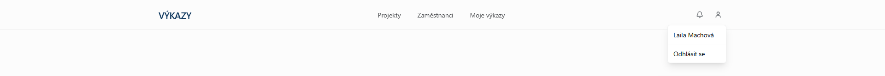

## Projekty

[KRÁTKÝ TEXT O TOMTO MODULU - NE KAŽDÝ HO VIDÍ, PROČ EXISTUJE A TAK. KRÁTCE.]

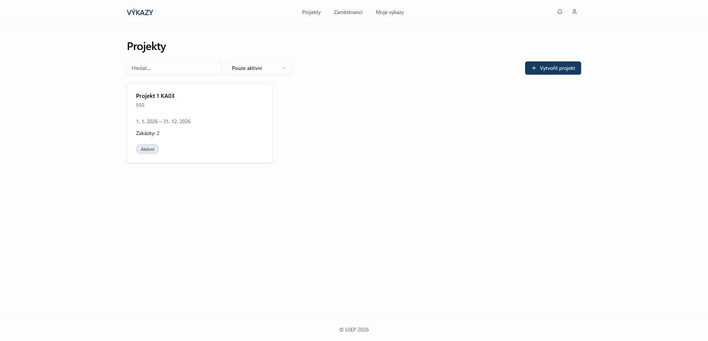

### Vytvoření projektu

...

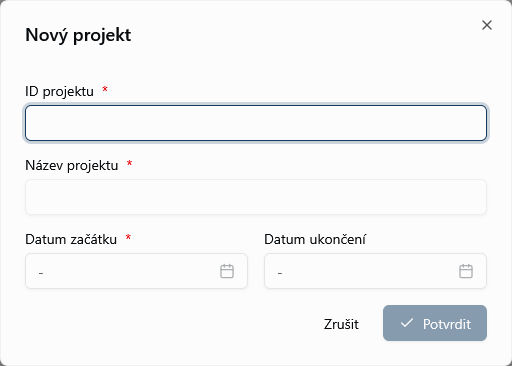

### Úprava projektu

...

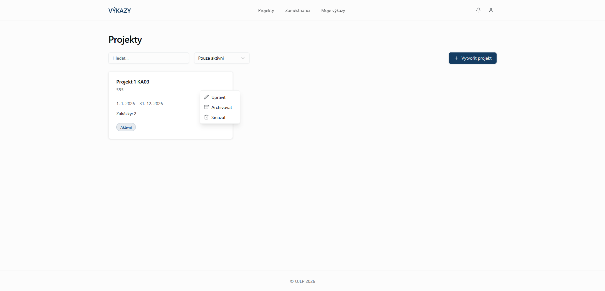

...

### Přidání manažera projektu

...

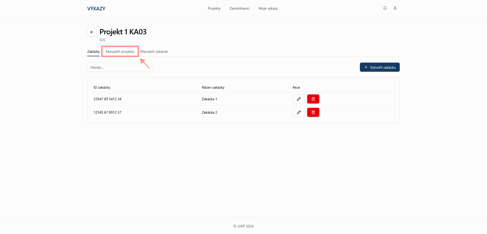
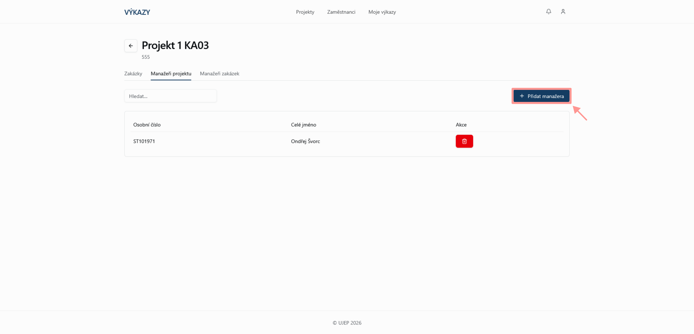
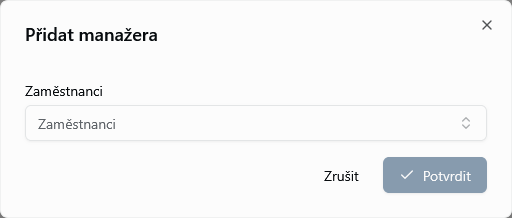

## Zakázky

### Vytvoření zakázky

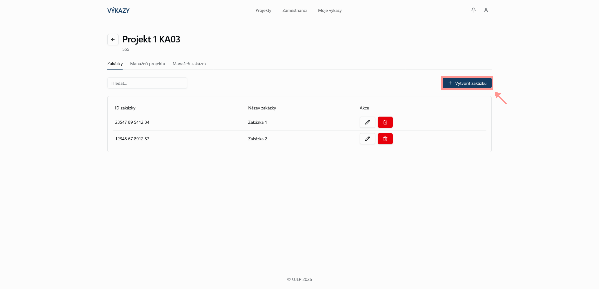
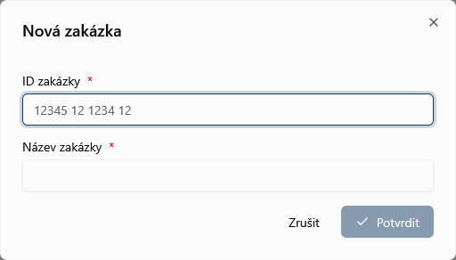

### Úprava zakázky

### Přidání manažera zakázky

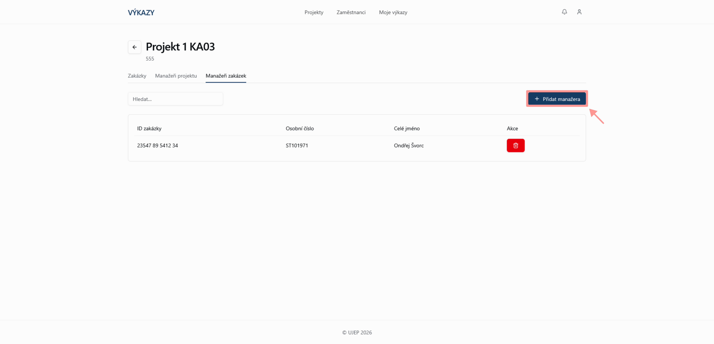

### Přidání zaměstnance do zakázky

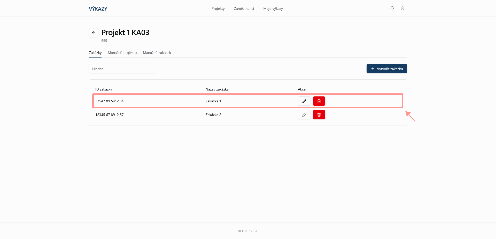
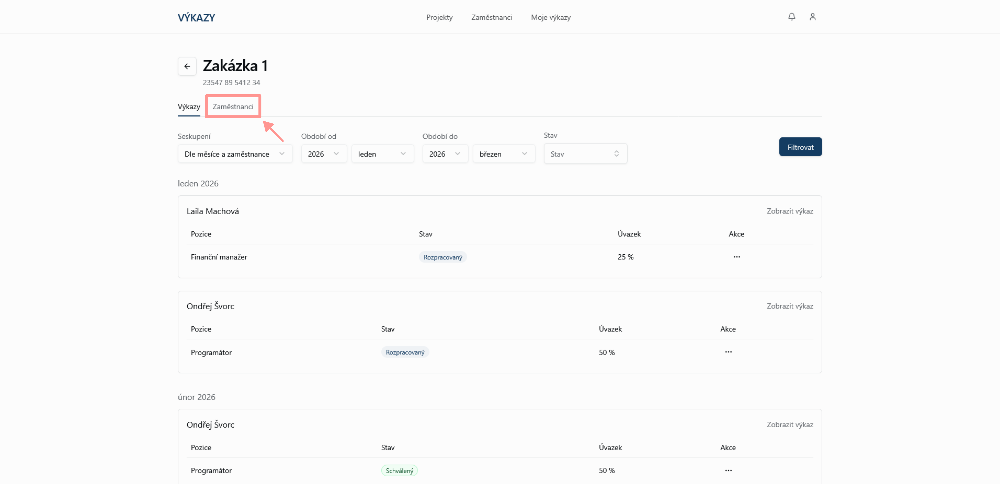
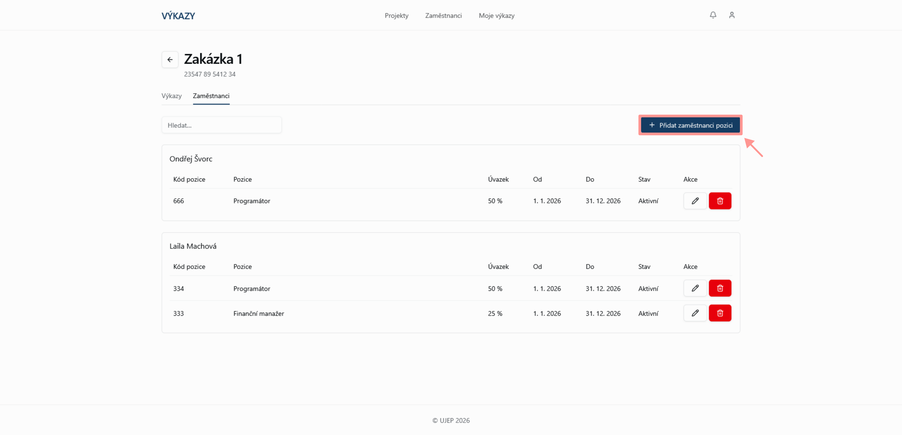

## Zaměstnanci

### Vytvoření pracovní pozice

### Úprava pracovní pozice

### Přehled pracovních pozic

## Docházka

### Export docházky z IMIS
[ZDE SCREENSHOTY Z IMIS JAK TEN VÝKAZ SPRÁVNĚ VYEXPORTOVAT]

### Nahrání docházky z IMIS
V současné době není aplikace propojena se systémem IMIS. Docházku je proto nutné nejprve exportovat ze systému IMIS a následně ji nahrát do aplikace Výkazy.

[OBRÁZEK ZDE]

## Výkazy

### Úprava výkazu

### Odeslání výkazu ke schválení

### Schválení výkazu

### Vrácení výkazu k přepracování

### Historie schvalování

## Otázky a odpovědi

**Co se stane, když není vyplněno datum ukončení projektu?**

...

**Lze datum ukončení projektu změnit?**

...

**Může být zaměstnanec přiřazen do více zakázek současně?**

...

**Lze zaměstnance ze zakázky odebrat?**

...

**Jaký je rozdíl mezi akademickým a neakademickým pracovníkem?**

...

**Kdo může upravovat údaje zaměstnance?**

...

**Kdo může výkaz schválit?**

...

**Lze upravovat již schválený výkaz?**

...

**Jak poznám, že byl výkaz vrácen k úpravě?**

...